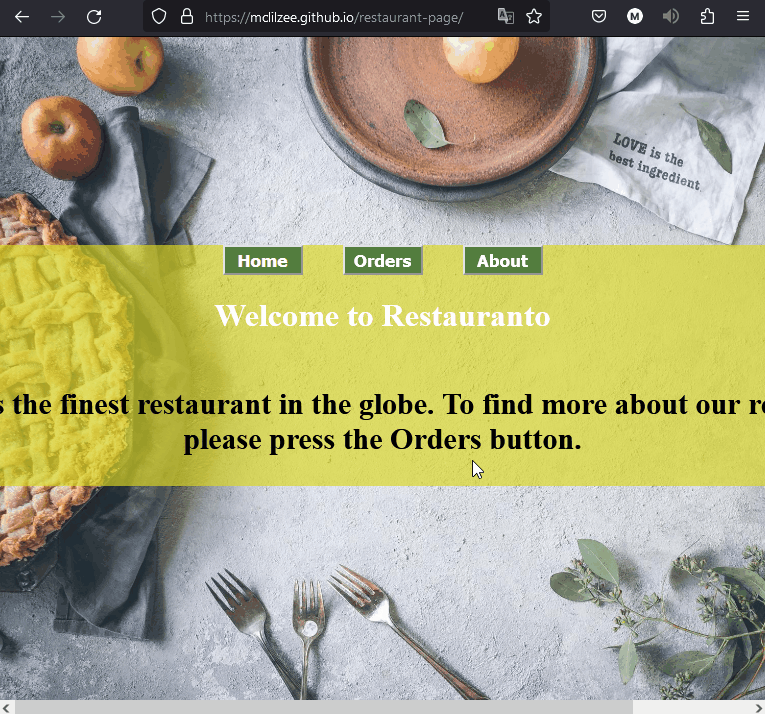

# <a href="https://mclilzee.github.io/restaurant-page/">Restaurant Page</a>
A simple restaurant page using a simple Native HTML / JavaScript / CSS and Webpack
You can check orders, about, and the home page

# Disclaimer
This website is not functional and just a demonstration of building front-end web design.

# Examples

# Credit

### Lasagna Photo
<a href="https://unsplash.com/@sunorwind?utm_source=unsplash&utm_medium=referral&utm_content=creditCopyText">sunorwind</a> on <a href="https://unsplash.com/s/photos/lasagna?utm_source=unsplash&utm_medium=referral&utm_content=creditCopyText">Unsplash</a>

### Potato Photo
<a href="https://unsplash.com/@moniqa?utm_source=unsplash&utm_medium=referral&utm_content=creditCopyText">Monika Grabkowska</a> on <a href="https://unsplash.com/s/photos/potato?utm_source=unsplash&utm_medium=referral&utm_content=creditCopyText">Unsplash</a>
  
### Eggs Photo
<a href="https://unsplash.com/@coffeefyworkafe?utm_source=unsplash&utm_medium=referral&utm_content=creditCopyText">Coffeefy Workafe</a> on <a href="https://unsplash.com/s/photos/eggs?utm_source=unsplash&utm_medium=referral&utm_content=creditCopyText">Unsplash</a>
